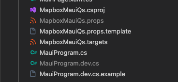

# Mapbox for MAUI

A dedicated library and starting sample for integrating Mapbox into your MAUI application.

# Installation

```
Install-Package Mapbox.Maui --version 10.11.1.1
```

## Integrate into your project

Please check out [my step-by-step blog post](https://tuyen-vuduc.tech/how-to-use-mapbox-in-your-dotnet-maui-app) for more details.

## How to run the examples

### Prerequisites
- Visual Studio for Mac or Visual Studio for Windows
- .NET 7.0.306
- .NET workloads for iOS, Android, MAUI

### Steps

- 1/ Generate/grab `MAPBOX_DOWNLOADS_TOKEN` from [your Mapbox account page](https://account.mapbox.com/)
   
- 2/ Android: Put it into your local `~/.gradle/gradle.properties`

```bash
echo "MAPBOX_DOWNLOADS_TOKEN=YOUR_MAPBOX_DOWNLOADS_TOKEN" >> ~/.gradle/gradle.properties
```
- 3/ Make a copy of `MapboxMauiQs.props.template`
	- Name it `MapboxMauiQs.props`
	- Replace `YOUR_MAPBOX_DOWNLOADS_TOKEN` with yours in `MapboxMauiQs.props` file
- 4/ Grab `mapbox_access_token` from [your Mapbox account page](https://account.mapbox.com/)
    - Make a copy of `MauiProgram.dev.cs.template`
	- Name it `MauiProgram.dev.cs`
	- Replace `YOUR_MAPBOX_ACCESS_TOKEN` with yours in `MauiProgram.dev.cs` file



- 5/ Run the solution

# Ported Examples

| # | Example | Ported (18/66) |
| - | - | - |
| 1 | [AddMarkersSymbol](./src/qs/MapboxMauiQs/Examples/01.AddMarkersSymbol/AddMarkersSymbolExample.cs) |  OK  |
| 2 | [AddOneMarkerSymbol](./src/qs/MapboxMauiQs/Examples/02.AddOneMarkerSymbol/AddOneMarkerSymbolExample.cs) |  OK  |
| 3 | [AdvancedViewportGestures](./src/qs/MapboxMauiQs/Examples/03.AdvancedViewportGestures/AdvancedViewportGesturesExample.cs) |    |
| 4 | [AnimateGeoJSONLine](./src/qs/MapboxMauiQs/Examples/04.AnimateGeoJSONLine/AnimateGeoJSONLineExample.cs) |    |
| 5 | [AnimateImageLayer](./src/qs/MapboxMauiQs/Examples/05.AnimateImageLayer/AnimateImageLayerExample.cs) |    |
| 6 | [AnimateLayer](./src/qs/MapboxMauiQs/Examples/06.AnimateLayer/AnimateLayerExample.cs) |    |
| 7 | [AnimatedMarker](./src/qs/MapboxMauiQs/Examples/07.AnimatedMarker/AnimatedMarkerExample.cs) |  OK  |
| 8 | [BasicLocationPulsing](./src/qs/MapboxMauiQs/Examples/08.BasicLocationPulsing/BasicLocationPulsingExample.cs) |    |
| 9 | [BasicMap](./src/qs/MapboxMauiQs/Examples/09.BasicMap/BasicMapExample.xaml) |  OK  |
| 10 | [BuildingExtrusions](./src/qs/MapboxMauiQs/Examples/10.BuildingExtrusions/BuildingExtrusionsExample.cs) |  OK  |
| 11 | [CameraAnimation](./src/qs/MapboxMauiQs/Examples/11.CameraAnimation/CameraAnimationExample.cs) |    |
| 12 | [CameraAnimators](./src/qs/MapboxMauiQs/Examples/12.CameraAnimators/CameraAnimatorsExample.cs) |    |
| 13 | [CircleAnnotation](./src/qs/MapboxMauiQs/Examples/13.CircleAnnotation/CircleAnnotationExample.cs) |  OK  |
| 14 | [ColorExpression](./src/qs/MapboxMauiQs/Examples/14.ColorExpression/ColorExpressionExample.cs) |    |
| 15 | [Custom2DPuck](./src/qs/MapboxMauiQs/Examples/15.Custom2DPuck/Custom2DPuckExample.cs) |    |
| 16 | [Custom3DPuck](./src/qs/MapboxMauiQs/Examples/16.Custom3DPuck/Custom3DPuckExample.cs) |    |
| 17 | [CustomLayer](./src/qs/MapboxMauiQs/Examples/17.CustomLayer/CustomLayerExample.cs) |    |
| 18 | [CustomLocationProvider](./src/qs/MapboxMauiQs/Examples/18.CustomLocationProvider/CustomLocationProviderExample.cs) |    |
| 19 | [CustomPointAnnotation](./src/qs/MapboxMauiQs/Examples/19.CustomPointAnnotation/CustomPointAnnotationExample.cs) |  OK  |
| 20 | [CustomStyleURL](./src/qs/MapboxMauiQs/Examples/20.CustomStyleURL/CustomStyleURLExample.cs) |  OK  |
| 21 | [DataDrivenSymbols](./src/qs/MapboxMauiQs/Examples/21.DataDrivenSymbols/DataDrivenSymbolsExample.cs) |    |
| 22 | [DataJoin](./src/qs/MapboxMauiQs/Examples/22.DataJoin/DataJoinExample.cs) |    |
| 23 | [DebugMap](./src/qs/MapboxMauiQs/Examples/23.DebugMap/DebugMapExample.cs) |  OK  |
| 24 | [DistanceExpression](./src/qs/MapboxMauiQs/Examples/24.DistanceExpression/DistanceExpressionExample.cs) |    |
| 25 | [ExternalVectorSource](./src/qs/MapboxMauiQs/Examples/25.ExternalVectorSource/ExternalVectorSourceExample.cs) |    |
| 26 | [FeatureState](./src/qs/MapboxMauiQs/Examples/26.FeatureState/FeatureStateExample.cs) |    |
| 27 | [FeaturesAtPoint](./src/qs/MapboxMauiQs/Examples/27.FeaturesAtPoint/FeaturesAtPointExample.cs) |    |
| 28 | [FrameViewAnnotations](./src/qs/MapboxMauiQs/Examples/28.FrameViewAnnotations/FrameViewAnnotationsExample.cs) |    |
| 29 | [Globe](./src/qs/MapboxMauiQs/Examples/29.Globe/GlobeExample.cs) |    |
| 30 | [GlobeFlyTo](./src/qs/MapboxMauiQs/Examples/30.GlobeFlyTo/GlobeFlyToExample.cs) |    |
| 31 | [HeatmapLayerGlobe](./src/qs/MapboxMauiQs/Examples/31.HeatmapLayerGlobe/HeatmapLayerGlobeExample.cs) |    |
| 32 | [IconSizeChange](./src/qs/MapboxMauiQs/Examples/32.IconSizeChange/IconSizeChangeExample.cs) |  OK  |
| 33 | [LargeGeoJSONPerformance](./src/qs/MapboxMauiQs/Examples/33.LargeGeoJSONPerformance/LargeGeoJSONPerformanceExample.cs) |    |
| 34 | [LayerPosition](./src/qs/MapboxMauiQs/Examples/34.LayerPosition/LayerPositionExample.cs) |    |
| 35 | [LineAnnotation](./src/qs/MapboxMauiQs/Examples/35.LineAnnotation/LineAnnotationExample.cs) |  OK  |
| 36 | [LineGradient](./src/qs/MapboxMauiQs/Examples/36.LineGradient/LineGradientExample.cs) |    |
| 37 | [LiveData](./src/qs/MapboxMauiQs/Examples/37.LiveData/LiveDataExample.cs) |    |
| 38 | [Localization](./src/qs/MapboxMauiQs/Examples/38.Localization/LocalizationExample.cs) |    |
| 39 | [MultipleGeometries](./src/qs/MapboxMauiQs/Examples/39.MultipleGeometries/MultipleGeometriesExample.cs) |  OK  |
| 40 | [NavigationSimulator](./src/qs/MapboxMauiQs/Examples/40.NavigationSimulator/NavigationSimulatorExample.cs) |    |
| 41 | [OfflineManager](./src/qs/MapboxMauiQs/Examples/41.OfflineManager/OfflineManagerExample.cs) |  OK  |
| 42 | [OfflineRegionManager](./src/qs/MapboxMauiQs/Examples/42.OfflineRegionManager/OfflineRegionManagerExample.cs) |    |
| 43 | [PitchAndDistance](./src/qs/MapboxMauiQs/Examples/43.PitchAndDistance/PitchAndDistanceExample.cs) |    |
| 44 | [PointAnnotationClustering](./src/qs/MapboxMauiQs/Examples/44.PointAnnotationClustering/PointAnnotationClusteringExample.cs) |  OK  |
| 45 | [PointClustering](./src/qs/MapboxMauiQs/Examples/45.PointClustering/PointClusteringExample.cs) |    |
| 46 | [PolygonAnnotation](./src/qs/MapboxMauiQs/Examples/46.PolygonAnnotation/PolygonAnnotationExample.cs) |  OK  |
| 47 | [RasterTileSource](./src/qs/MapboxMauiQs/Examples/47.RasterTileSource/RasterTileSourceExample.cs) |    |
| 48 | [ResizableImage](./src/qs/MapboxMauiQs/Examples/48.ResizableImage/ResizableImageExample.cs) |    |
| 49 | [RestrictCoordinateBounds](./src/qs/MapboxMauiQs/Examples/49.RestrictCoordinateBounds/RestrictCoordinateBoundsExample.cs) |    |
| 50 | [SceneKit](./src/qs/MapboxMauiQs/Examples/50.SceneKit/SceneKitExample.cs) |  N/A  |
| 51 | [ShowHideLayer](./src/qs/MapboxMauiQs/Examples/51.ShowHideLayer/ShowHideLayerExample.cs) |    |
| 52 | [SkyLayer](./src/qs/MapboxMauiQs/Examples/52.SkyLayer/SkyLayerExample.cs) |  OK  |
| 53 | [SnapshotterCoreGraphics](./src/qs/MapboxMauiQs/Examples/53.SnapshotterCoreGraphics/SnapshotterCoreGraphicsExample.cs) |    |
| 54 | [Snapshotter](./src/qs/MapboxMauiQs/Examples/54.Snapshotter/SnapshotterExample.cs) |    |
| 55 | [SpinningGlobe](./src/qs/MapboxMauiQs/Examples/55.SpinningGlobe/SpinningGlobeExample.cs) |    |
| 56 | [StoryboardMapView](./src/qs/MapboxMauiQs/Examples/56.StoryboardMapView/StoryboardMapViewExample.cs) |  N/A  |
| 57 | [SwitchStyles](./src/qs/MapboxMauiQs/Examples/57.SwitchStyles/SwitchStylesExample.cs) |    |
| 58 | [SymbolClustering](./src/qs/MapboxMauiQs/Examples/58.SymbolClustering/SymbolClusteringExample.cs) |  OK  |
| 59 | [Terrain](./src/qs/MapboxMauiQs/Examples/59.Terrain/TerrainExample.cs) |  OK  |
| 60 | [TrackingMode](./src/qs/MapboxMauiQs/Examples/60.TrackingMode/TrackingModeExample.cs) |    |
| 61 | [ViewAnnotationAnimation](./src/qs/MapboxMauiQs/Examples/61.ViewAnnotationAnimation/ViewAnnotationAnimationExample.cs) |    |
| 62 | [ViewAnnotationBasic](./src/qs/MapboxMauiQs/Examples/62.ViewAnnotationBasic/ViewAnnotationBasicExample.cs) |    |
| 63 | [ViewAnnotationMarker](./src/qs/MapboxMauiQs/Examples/63.ViewAnnotationMarker/ViewAnnotationMarkerExample.cs) |    |
| 64 | [ViewAnnotationWithPointAnnotation](./src/qs/MapboxMauiQs/Examples/64.ViewAnnotationWithPointAnnotation/ViewAnnotationWithPointAnnotationExample.cs) |    |
| 65 | [Viewport](./src/qs/MapboxMauiQs/Examples/65.Viewport/ViewportExample.cs) |    |
| 66 | [VoiceOverAccessibility](./src/qs/MapboxMauiQs/Examples/66.VoiceOverAccessibility/VoiceOverAccessibilityExample.cs) |    |

NOTE: A handy command to generate a new example

```
dotnet cake -- --name SymbolClustering --index 58 --group Annotations --title "Add Cluster Symbol Annotations" --subtitle "Show fire hydrants in Washington DC area in a cluster using a symbol layer."
````

# Known issues
- The library is not yet able to build to run on iOS real device. [Issue](https://github.com/xamarin/xamarin-macios/issues/8917)

# Maintainer
This project is maintained by [tuyen-vuduc](https://github.com/tuyen-vuduc) in his spare time and/or when requested.<br>

If you find this project is helpful and benefit your work/business, please give it a star, become a sponsor of the project and/or buy him a coffee.

[](https://www.buymeacoffee.com/tuyen.vuduc)

# LICENSE
This library is release under The BSD 3-Clause License. You are freely to use and make changes. 
However, this license doesn't override [the license from Mapbox](https://www.mapbox.com/legal/tos).